# 01 · Modelo de datos de Contífico (reconstruido)

Entidades y relaciones observadas en formularios, API y espejo. Los nombres son los de Contífico (campo web / API). Diagrama en Mermaid `erDiagram` (verificado con mermaid@11 + jsdom antes de publicar).

```mermaid
erDiagram
    EMPRESA ||--o{ USUARIO : tiene
    EMPRESA ||--o{ ESTABLECIMIENTO : declara
    ESTABLECIMIENTO ||--o{ POS : "punto de emision"
    POS }o--|| BODEGA : "bodega asociada"
    BODEGA }o--|| CENTRO_COSTO : "por defecto"
    CENTRO_COSTO ||--o{ CENTRO_COSTO : padre
    POS ||--o{ COMERCIO_TC : "red y codigo"
    PERSONA ||--o{ DOCUMENTO : "cliente o proveedor"
    PERSONA ||--o{ FICHA_LABORAL : "si es empleado"
    PERSONA }o--o| CUENTA_CONTABLE : "cxc y cxp"
    CATEGORIA ||--o{ PRODUCTO : agrupa
    CATEGORIA ||--o{ CATEGORIA : padre
    UNIDAD ||--o{ PRODUCTO : "unidad base y factores"
    PRODUCTO }o--o| CUENTA_CONTABLE : "venta compra costo"
    PRODUCTO ||--o{ FORMULA_GRUPO : "si es COP o PRO"
    FORMULA_GRUPO ||--o{ FORMULA_DETALLE : opciones
    FORMULA_DETALLE }o--|| PRODUCTO : componente
    PRODUCTO ||--o{ COMBO_DETALLE : "si es COM"
    COMBO_DETALLE }o--|| PRODUCTO : terminado
    DOCUMENTO ||--o{ LINEA_PRODUCTO : detalles
    DOCUMENTO ||--o{ LINEA_CUENTA : "gasto directo"
    DOCUMENTO ||--o{ LINEA_ACTIVO_FIJO : "compra de activo"
    DOCUMENTO ||--o{ RETENCION : "IR e IVA"
    DOCUMENTO ||--o{ COBRO : cobros
    DOCUMENTO ||--o{ FORMA_PAGO_SRI : "plazo y codigo"
    DOCUMENTO }o--o| DOCUMENTO : relacionado
    DOCUMENTO }o--|| POS : "caja emisora"
    DOCUMENTO }o--|| BODEGA : "descarga inventario"
    LINEA_PRODUCTO }o--|| PRODUCTO : vende
    LINEA_PRODUCTO }o--o| CENTRO_COSTO : imputa
    LINEA_CUENTA }o--|| CUENTA_CONTABLE : imputa
    TRANSACCION ||--o{ TRANSACCION_DETALLE : "documentos anticipos cuentas"
    TRANSACCION_DETALLE }o--o| DOCUMENTO : paga
    TRANSACCION_DETALLE }o--o| ANTICIPO : consume
    TRANSACCION }o--o| CUENTA_BANCARIA : "banco destino"
    DEPOSITO }o--|| POS : "cierre de caja"
    DEPOSITO }o--|| CUENTA_BANCARIA : deposita
    COBRO }o--o| LOTE_TC : "si es tarjeta"
    LOTE_TC }o--|| COMERCIO_TC : red
    LIQUIDACION_TC ||--o{ LOTE_TC : liquida
    LIQUIDACION_TC ||--o{ RETENCION : "retencion del banco"
    MOVIMIENTO_INVENTARIO ||--o{ MOVIMIENTO_DETALLE : lineas
    MOVIMIENTO_DETALLE }o--|| PRODUCTO : afecta
    MOVIMIENTO_INVENTARIO }o--|| BODEGA : origen
    MOVIMIENTO_INVENTARIO }o--o| BODEGA : destino
    MOVIMIENTO_INVENTARIO }o--o| DOCUMENTO : "origen DOC"
    PRODUCCION ||--o{ PRODUCCION_DETALLE : "productos terminados"
    PRODUCCION ||--o{ MOVIMIENTO_INVENTARIO : "genera EGR e ING"
    TOMA_FISICA ||--o{ MOVIMIENTO_INVENTARIO : "genera ajustes"
    TOMA_FISICA }o--|| BODEGA : cuenta
    ASIENTO ||--o{ ASIENTO_LINEA : "debe y haber"
    ASIENTO_LINEA }o--|| CUENTA_CONTABLE : cuenta
    ASIENTO_LINEA }o--o| CENTRO_COSTO : imputa
    ASIENTO_LINEA }o--o| PROYECTO : imputa
    CUENTA_CONTABLE ||--o{ CUENTA_CONTABLE : padre
    EJERCICIO_CONTABLE ||--o{ ASIENTO : contiene
    MOVIMIENTO_BANCARIO }o--|| CUENTA_BANCARIA : afecta
    MOVIMIENTO_BANCARIO ||--o{ MOVIMIENTO_BANCARIO_LINEA : "cuenta cc proyecto"
    CONCILIACION ||--o{ MOVIMIENTO_BANCARIO : marca
    CUENTA_BANCARIA }o--|| CUENTA_CONTABLE : contabiliza
    ACTIVO_FIJO }o--|| CATEGORIA_ACTIVO : "cuentas y porcentaje"
    ACTIVO_FIJO }o--|| UBICACION_ACTIVO : ubicado
    ROL_PAGO ||--o{ ROL_PAGO_EMPLEADO : "ingresos egresos"
    ROL_PAGO_EMPLEADO }o--|| FICHA_LABORAL : empleado
    PRESTAMO }o--|| FICHA_LABORAL : "descuenta en rol"
    ROL_PAGO ||--o{ ASIENTO : "tipo Nomina"
    ROL_PAGO ||--o{ MOVIMIENTO_BANCARIO : "pago transferencia"
    SEGMENTO ||--o{ PROMOCION : target
    NIVEL ||--o{ PROMOCION : target
    PROMOCION }o--o{ POS : "puntos de venta"
    USUARIO ||--o{ PERMISO : "por entidad y accion"
```

## Entidades: llaves y estados
| Entidad | Llave(s) | Estados / tipos | Dónde |
|---|---|---|---|
| Empresa | RUC; `empresa_id` (19875) | plan PREMIUM; banderas SRI | `empresa/configuracion/general/` |
| Usuario | `user_id`, email | A/P/I; perfil A/S/D/V/L/T/C + ~300 permisos | `usuarios/`, `usuario/registrar/` |
| Establecimiento / POS | código EEE; POS `pk` (8731…13473) con `establecimiento`, `emision` PPP, bodega, dirección | — | `pos/consultar_pos/` |
| Bodega | `pk` web (59587…), `id` API, código BOD001…BOD012 | activa; centro de costo | `inventario/bodega/` |
| Centro de costo / Proyecto | `id` API, `pk` web; `padre_id` | A/I; T transaccional / G grupo | `contabilidad/centro_costo/` |
| Cuenta contable | código jerárquico (1.1.1.3.1), `id` API, `pk` web | G grupo / C cuenta; tipo de uso | `contabilidad/cuenta/` |
| Persona | `id` API, `pk` web; cédula/RUC/pasaporte/placa | A/I; tipo N/J/I/P; roles booleanos | `persona/` |
| Ficha laboral | dentro de Persona | contrato CA/CT/OC/TP/SO/LO/EE/EM; grupo A/V/C/O; rol RPM/RPQ | `persona/registrar/` pestaña RRHH |
| Producto | `id` API, `pk` web, `codigo` | A/I; tipo PRO/SER; tipo_producto SIM/COM/COP/PRO | `inventario/producto/` |
| Fórmula (grupo, detalle) | `tipo_formula_N`, `tipo_formula_N_M` | grupo 0 NE fijos; N≥1 UN/VA | `producto/consultar/{pk}/` |
| Documento | `id` API, `pk` web; número EEE-PPP-NNNNNNNNN; clave de acceso SRI | tipo (20+ códigos); estado P/C/G/A/E/F; anulado; electrónico; firmado/enviado/autorizado | `registro/documento/` |
| Retención | número 001-PPP-NNNNNNNNN; `codigo_sri` | F/E; autorizada | dentro del documento |
| Transacción (cobro/pago) | `id`; `numero_comprobante` | C/P/PM/CM/CPM/R; postfechado; repuesto; depositado | `registro/transaccion/` |
| Depósito | `id`; fecha de corte; caja | — | `registro/deposito/` |
| Lote TC / Liquidación TC | `RECAP`, POS, red; liquidación `numero_documento` del banco | Pendiente (Faltante) / liquidado | `tarjeta_credito/` |
| Movimiento de inventario | `id` API (varios por código en 2026), `codigo` ING/EGR/TRA/AJU YYYYMM… | G/P; origen DOC/PRO/MAN/IMP/API/AUT/ORP/MED/LIQ; asiento generado sí/no | `inventario/movimiento/` |
| Producción | `pk`; código PRO YYYYMM… | P pendiente / R producido / S provisional | `inventario/produccion/` |
| Toma física | `pk`; código TFI YYYYMM… | genera ING/EGR | `inventario/tomafisica/` |
| Asiento | `id` API; prefijo NOM/ASI (doc.) | tipo por origen (Compra, Venta, …); gasto no deducible | `contabilidad/libro_diario/` |
| Ejercicio contable | fechas | abierto/cerrado; cierre mensual | `contabilidad/ejercicio_contable/` |
| Movimiento bancario | `pk`; comprobante | E/I; D/N/X/C/T; anulado; conciliado | `banco/movimientos/` |
| Activo fijo | código | A/I/D/V; % depreciación | `activo_fijo/activo/` |
| Rol de pago | período (mes, quincena) | C creada / G generada; RPM/RPQ | `rrhh/periodos/` |
| Préstamo | `pk` | tipo A/H/Q/P/I/L/S/C/F/M/D; P/G | `rrhh/prestamos/` |
| Segmento / Nivel / Regla / Promoción | `pk` | activo; tipo | `fidelizacion/` |

## Notas de modelado
- El **documento** es el centro: de él cuelgan líneas (4 clases), retenciones, cobros y formas de pago, y hacia él apuntan movimientos de inventario (origen DOC), asientos (sin llave, solo glosa) y transacciones.
- **Persona** concentra cliente, proveedor y empleado; la ficha laboral no es entidad propia.
- **Producto** tiene tres composiciones posibles: fórmula de producción (PRO), fórmula con grupos (COP) y combo comercial (COM).
- **POS** une facturación (punto de emisión), inventario (bodega) y tarjetas (comercio).
- Identificadores: API (`id` alfanumérico de integración) ≠ web (`pk` numérico); mapeo por selectores.
